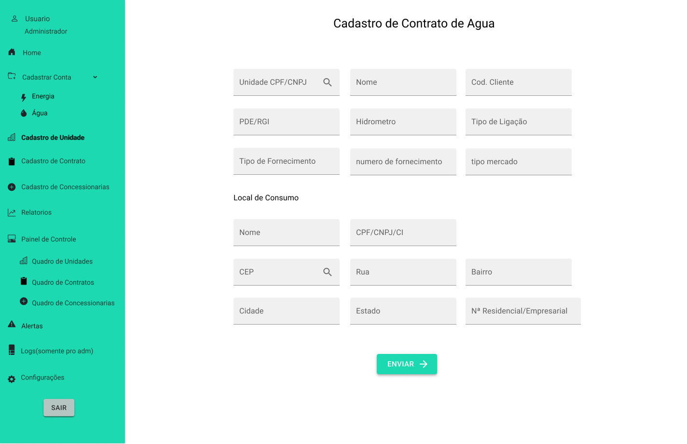
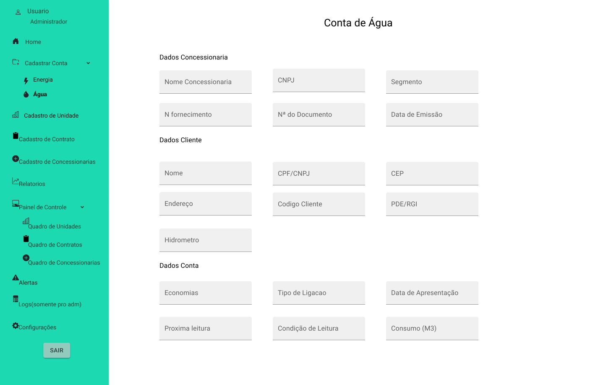
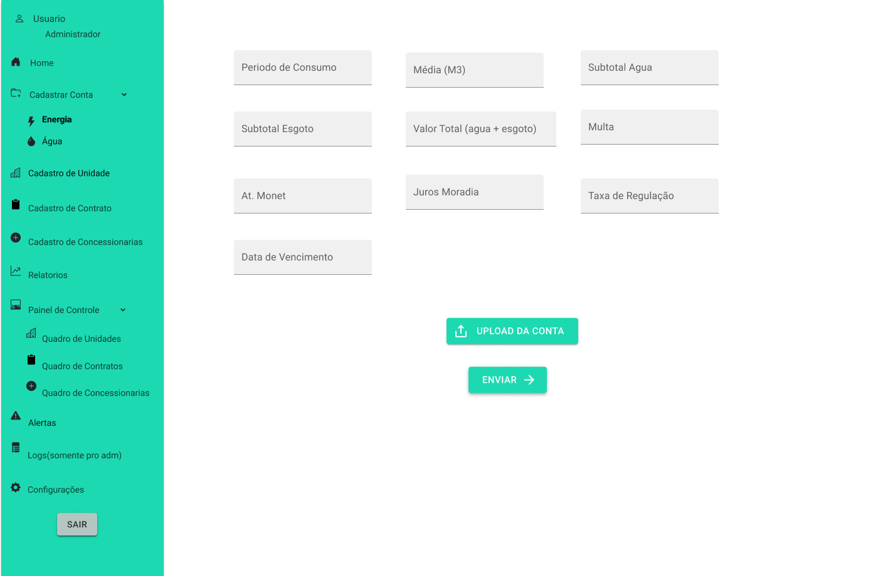

<body>
  <div align="center">
    <h1>Julio Cesar de Oliveira Martins</h1>
    <kbd></kbd>
    <p><a href="https://www.linkedin.com/in/juliocesar2811/"></a></p>
  </div>
</body>

## Introdução

Olá, seja bem-vindo. Sou o Julio Cesar, estudante de Banco de Dados pela FATEC Prof. Jessen Vidal. 

Tenho 25 anos e trabalho como Desenvolvedor de Software Júnior. <br/>


### Meus principais conhecimentos

#### Javascript


#### React

#### SQL


### Projetos Integradores durante a graduação 
<details >
  <summary>Projeto 1: 1º Semestre de 2021</summary>
  
  # Projeto 1: 1º Semestre de 2021

  ### Parceiro Acadêmico
  Fatec Prof. Jessen Vidal (proposta realizada pelo docente responsável pela disciplina que ordenou o projeto)


  ### Visão do Projeto
  A proposta do projeto foi a elaboração de um website institucional visando a melhoria da visibilidade do centro de convivência infantil vó Maria Felix para o público de modo geral, onde o usuário poderá facilmente ter o acesso a informação sobre a ong como: sua criação, história, funcionamento e os projetos em andamento.

  os interessados em ajudar na causa poderão fazer inscrição para ser voluntariado, doações, projetos / parcerias e podem ajudar compartilhando a ong através do site.

  Link do repositório do projeto: https://github.com/juliocesar1316/Projeto-Site-Intitucional

  ### Tecnologias adotadas na solução

  #### HTML e CSS
  #### Javascript
  #### MySQL
  #### PHP

  ### Contribuições pessoais
  -modelagem do design do site na plataforma marvel
  -html e css junto com php
  -banco de dados

  ### Aprendizados Efetivos HS

</details>

<details>
  <summary>Projeto 2: 2º semestre de 2021</summary>

  # Projeto 2: 2º semestre de 2021

  ### Parceiro Acadêmico
  JetSoft <br/>

  <br/>
  ##### *Figura 01. JetSoft*

  ### Visão do Projeto

  O projeto foi elaborado para produzir um website para uma empresa de softwares que terceiriza serviços, onde ela terá a funcionalidade de emitir relatórios mensais apresentando o quadro de presença de colaboradores em posto de trabalhos acordados em contrato que passarão por um nível de aprovação. 

  Devido ao problema de falta de colaboradores se a empresa tiver acima de 20% de postos de trabalho em abertos, o mesmo paga multa de 35% do valor total do contrato e para que isso seja evitado outra funcionalidade do projeto e o quadro de colaboradores que possuirá alocações fixas e flutuantes parra caso ocorra eventos (férias, falta não justificada, licença diversas, demissão, entre outros). 

  Link do repositório do projeto: https://github.com/juliocesar1316/JetSoft

  ### Tecnologias adotadas na solução

  #### Flask
  #### HTML, CSS e JavaScript
  #### MySQL

  ### Contribuições pessoais
  -master
  -html, css e javascript
  -flask

  ### Aprendizados Efetivos HS

</details>

<details>
  <summary>Projeto 3: 1º semestre de 2022</summary>

  # Projeto 3: 1º semestre de 2022

  ## Parceiro Acadêmico
  tecsus <br/>
  
  ##### *Figura 02. tecsus*

  ### Visão do Projeto

  O projeto foi elaborado para produzir um software de gerenciamento de contas para uma startup que busca por meio da tecnologia tornar o planeta mais sustentável.
  O sistema será desenvolvido para que o processo de cadastramento de contas, unidade, concessionarias e contratos possa ser simples e intuitivo, além de proporcionar ao usuário uma experiência mais dinâmica ao exibir as informações relevantes através de relatórios e gráficos descomplicados para análise

  Link do repositório do projeto: https://github.com/juliocesar1316/TecSus

  ### Tecnologias adotadas na solução

  #### React
  #### Spring - java
  #### MySQL

  ### Contribuições pessoais

  Neste projeto eu estava atuando como Product Owner, onde era responsável pelo contato com cliente, definição de user storys, priorização do backlog e para este projeto eu realizei o design do mockup do aplicativo. 

  Após o contato com o cliente, foi possível a definição dos user storys e do mockup onde foi utilizado a ferramenta figma.
  <div id="table_use_cases" align="center" width="400">
    <table align="justify">
      <tr>
        <th>User Story id</th>
        <th>Como um (ator)</th>
        <th>Eu quero (ação)</th>
        <th>Para que seja possível (funcionalidade)</th>
        <th>Prioridade</th>
      </tr>
      <tr>
        <td>1</td>
        <td>Digitador</td>
        <td>Guardar no sistema os dados das contas de água para análises, relatórios e ter um controle de sistema</td>
        <td>Criar um cadastro de conta de água de maneira funcional e prático </td>
        <td>1</td>
      </tr>
      <tr>
        <td>2</td>
        <td>Digitador</td>
        <td>Guardar no sistema os dados das contas de energia para análises, relatórios e ter um controle de sistema</td>
        <td>Criar um cadastro de conta de energia de maneira funcional e prático </td>
        <td>2</td>
      </tr>
      <tr>
        <td>3</td>
        <td>Digitador</td>
        <td>Guardar no sistema dados de unidades e ou empresas para análises, relatórios e ter um controle de sistema</td>
        <td>Criar um cadastro de unidades de maneira funcional e prático </td>
        <td>3</td>
      </tr>
      <tr> 
        <td>4</td>
        <td>Digitador</td>
        <td>Guardar no sistema dados de concessionaria que faz o fornecimento para tais unidades para análises, relatórios e ter um controle de sistema</td>
        <td>Criar um cadastro de concessionarias de maneira funcional e prático </td>
        <td>4</td>
      </tr>
      <tr>
        <td>5</td>
        <td>Digitador</td>
        <td>Cadastrar os contratos acordado com os clientes e unidade com sua respectiva concessionaria do segmento de água/esgoto</td>
        <td>Criar um cadastro de contrato para contas de água/esgoto</td>
        <td>5</td>
      </tr>
      <tr>
        <td>6</td>
        <td>Digitador</td>
        <td>Cadastrar os contratos acordado com os clientes e unidade com sua respectiva concessionaria do segmento de energia</td>
        <td>Criar um cadastro de contrato para contas de energia</td>
        <td>6</td>
      </tr>
      <tr>
        <td>23</td>
        <td>Gestor, Digitador e Administrador</td>
        <td>Um sistema com bastante atalhos, que fique bem usual para os usuários e de fácil entendimento</td>
        <td>O sistema deve ser montado com menu lateral esquerdo com as abas de acesso totalmente limpo e de fácil acesso e para áreas externas do menu vão ser utilizados mais ou menos 100% da tela</td>
        <td>23</td>
      </tr>
    </table>
  </div>

  
  <br>  # Figura 03. Tela de contrato de agua*
  
  <br> # Figura 04. Tela de conta de agua pt1*
  
  <br>
  # Figura 05. Tela de conta de agua pt2*
  <br>
  <br>
  Após cliente aprovar o mockup e a priorização de backlog, podemos começar a organizar os grupos de back-end e front-end. Para este projeto foi utilizado as linguagens React para front-end, Spring Boot para back-end e para o banco de dados foi utilizado o Mysql. As linguagens foram utilizadas por serem requisitos e pela preferência do grupo.

  Apesar de esta operando como Product Owner, possuo algumas experiencias com React e como meu grupo não tinha pessoas para o front eu decidi conciliar o PO com o desenvolvimento do front-end.

  De começo para auxiliar na programação das telas foi utilizado a biblioteca MaterialUi onde foi utilizado campos de input, botões e estilos. Como o react trabalha com componentes no nosso projeto não foi diferente, para cada parte das páginas foi criado um componente para facilitar na programação e userStates para que seja feito o controle do estado das variáveis.

  ```
  export default function EditConcessionaria({ dados, modalEdit }) {
  
    const classes = useStyles();
    const [cnpj, setCnpj] = useState(dados.cnpj);
    const [nome, setNome] = useState(dados.nome);
    const [segmento, setSegmento] = useState(dados.segmento);
    const [cep, setCep] = useState(dados.cep);
    const [rua, setRua] = useState(dados.rua);
    const [bairro, setBairro] = useState(dados.bairro);
    const [estado, setEstado] = useState(dados.uf);
    const [cidade, setCidade] = useState(dados.cidade);
    const [num_resid, setNum_resid] = useState(dados.numero);
    const [telefone, setTelefone] = useState(dados.telefone);
    const [inscricao_est, setInscricao_est] = useState(dados.inscricao_estadual);
    const [inscricao_unic, setInscricao_unic] = useState(
      dados.inscricao_especial
    );

    async function handleUpdate() {
      const data = {
        id: dados.id,
        cnpj: cnpj,
        nome: nome,
        segmento: segmento,
        cep: cep,
        rua: rua,
        bairro: bairro,
        cidade: cidade,
        uf: estado,
        numero: num_resid,
        telefone: telefone,
        inscricao_estadual: inscricao_est,
        inscricao_especial: inscricao_unic,
      };
      await fetch(`${baseURL}/concessionaria/atualizar`, {
        method: "PUT",
        headers: {
          "Content-Type": "application/json",
        },
        body: JSON.stringify(data),
      });
    }

    return (
      <form className={classes.root} onSubmit={handleUpdate}>
        <div className={classes.campo}>
          <TextField
            className={classes.text}
            required
            id="outlined-required"
            label="CNPJ"
            variant="outlined"
            fullWidth
            onChange={(e) => setCnpj(e.target.value)}
            value={cnpj}
          />
    ...
  ```

  O componente que foi criado acima é um Modal que aonde retorna os dados que foram salvos e edita as informações. Usando o useState é possível guardar o dado salvo e editá-lo como segundo estado da variável. A função handleUpdate é executado após apertar o botão de enviar onde ele pega todas as alterações e atualiza os dados. No returno desse componente tem os inputs e as label que serão mostradas nesse modal.

  Esse é um exemplo de um componente de dados que retorna os dados da concessionaria para editar e assim como esse outros foram montados como inserir, editar e excluir dados do app.

  Para última sprint foi acordado com o cliente que era para ser inserido uma página de relatório com gráficos relacionados a contas de água e contas de energia inseridos.

  Para o gráfico optei por utilizar a biblioteca recharts para react onde ele consegue gerar um gráfico com os dados das contas.

  ```
  import {
  AreaChart,
  XAxis,
  YAxis,
  CartesianGrid,
  Tooltip,
  Area,
} from "recharts";
import FormControl from "@material-ui/core/FormControl";
import RadioGroup from "@material-ui/core/RadioGroup";
import FormControlLabel from "@material-ui/core/FormControlLabel";
import { useState } from "react";
import Radio from "@material-ui/core/Radio";
import "./style.css";

function GraficoAgua({ listaRelatorioAguas }) {
  const [variavelY, setVariavelY] = useState();
  const [legenda, setLegenda] = useState();
  const [checked, setChecked] = useState("Valor Total R$");

  const handleChange = (event) => {
    setChecked(event.target.value);
  };

  const dataConsumo = listaRelatorioAguas.map((x) => {
    const arrayData = x.data_emissao.split("-");
    const ano = `${arrayData[0]}`;
    const mes = `${arrayData[1]}`;
    return {
      name: `${mes}/${ano}`,
      uv: x.consumo_m3,
    };
  });

  const daTaValorTotal = listaRelatorioAguas.map((x) => {
    const arrayData = x.data_emissao.split("-");
    const ano = `${arrayData[0]}`;
    const mes = `${arrayData[1]}`;
    return {
      name: `${mes}/${ano}`,
      uv: x.valor_total,
    };
  });

  return (
    <div className="main-dados">
      <div className="Agua">
        <AreaChart
          width={900}
          height={450}
          data={variavelY ? variavelY : daTaValorTotal}
          margin={{ top: 30, right: 20, left: 0, bottom: 0 }}
        >
          <defs>
            <linearGradient id="colorUv" x1="0" y1="0" x2="0" y2="2">
              <stop offset="5%" stopColor="#5664D2" stopOpacity={0.8} />
              <stop offset="95%" stopColor="#5664D2" stopOpacity={0} />
            </linearGradient>
          </defs>
          <XAxis dataKey="name" />
          <YAxis />
          <CartesianGrid strokeDasharray="3 3" />
          <Tooltip />
          <Area
            type="monotone"
            name={legenda ? legenda : "Valor Total (R$)"}
            dataKey="uv"
            stroke="#5664D2"
            fillOpacity={1}
            fill="url(#colorUv)"
          />
        </AreaChart>
      </div>
      <div className="buttons">
        <FormControl component="fieldset">
          <RadioGroup row value={checked} onChange={handleChange}>
            <FormControlLabel
              value="Valor Total R$"
              control={<Radio />}
              label="Valor Total R$"
              onClick={() => {
                setVariavelY(daTaValorTotal);
                setLegenda("Valor Total (R$)");
              }}
            />
            <FormControlLabel
              value="Consumo Mês (M³)"
              control={<Radio />}
              label="Consumo Mês (M³)"
              onClick={() => {
                setVariavelY(dataConsumo);
                setLegenda("Consumo Mês (M³)");
              }}
            />
          </RadioGroup>
        </FormControl>
      </div>
    </div>
  );
}

export default GraficoAgua;
  ```
O código acima monta o gráfico através dos dados recebidos no JSON do back-end e filtra de acordo com os valor total mensal e consumo mensal.

Abaixo um gif de como ficou a montagem desse gráfico e os filtros.


E com isso é finalizado a api, colocamos o back-end no heroku para facilitar na requisição de dados do front-end e conseguimos entregar um bom projeto, o cliente ficou satisfeito com o resultado.

Porém nesta api eu estava como product owner porém dois integrantes que ficaram na parte do front não acabaram ajudando muito, então acabei que fiquei mais empenhado como desenvolvedor, mas nunca deixando minhas tarefas como product owner de lado. 

#### Hard Skills Efetivamente Desenvolvidas

-Figma<br>
  Para montagem do mockup do projeto.<br>
-React <br>
  Foi utilizado para montagem do front end junto com algumas bibliotecas como recharts e material ui<br>
-Heroku<br>
  Utilizado para hospedagem da parte do back-end do projeto<br>
-MySql<br>
  Utilizado para guardar os dados dos formulários e dados do front-end<br>

#### Soft Skills Efetivamente Desenvolvidas
-Comunicação<br>
  Utilizada para estabelecer os critérios e validação com o cliente e para comunicar com o grupo<br>
-Escuta Ativa<br>
  Utilizada para coletar ideais, críticas e soluções para entender e desenvolver melhor o projeto e para melhor experiencia do usuário<br>
-Trabalho em Equipe<br>
  Utilizado para a montagem geral do projeto, coleta de ideias e ajudar o grupo nas partes que sentem dificuldade para assim gerar um bom trabalho em um bom tempo.<br>
-Liderança<br>
  Utilizado para liderar o grupo da melhor forma possível de acordo com os critérios e gosto do cliente e como desenvolvedor liderar o front-end para que fique adequado e o cliente fique satisfeito <br>

### Aprendizados Efetivos HS

</details>

## Contatos:

- [LinkedIn;](https://www.linkedin.com/in/juliocesar2811/)
- [GitHub.](https://github.com/juliocesar1316) 

